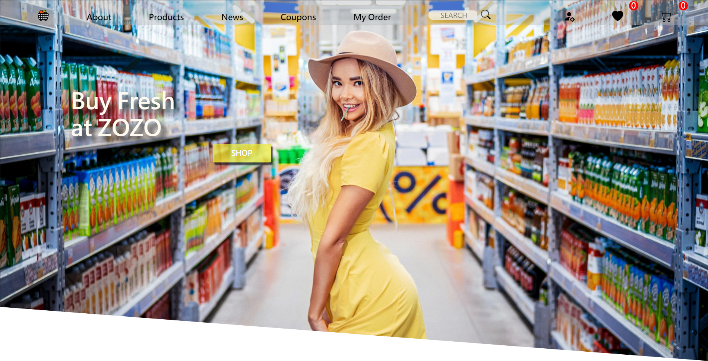

# ZOZO - Online Shopping Market

<h1>Purpose</h1>

To practice the skill after acquiring Vue3(Composition API), and integrate various libraries for a shopping website 

API and Backend origin from <a href="https://www.hexschool.com/qa/how-to.html">六角學院</a>

This API provides administrator and user with basic experiences in purchasing stuff from Online Shopping website

<h1>Guides</h1>

Download ZIP or Clone to localhost

<h3>Install</h3>

npm install

<h3>Execute</h3>

npm run dev

<h1>Features</h1>
<h5>Client Side</h5>
<ul>
  <li>Commoditeis Display</li>
  <li>Shopping Cart(add, Qty Adjustment, delete, )</li>
  <li>News</li>
  <li>Coupons</li>
  <li>Order</li>
  <li>Favorite</li>
  <li>Checkout</li>
</ul>
<h5>Server Side</h5>
<ul>
  <li>Log In/Log Out</li>
  <li>Commodites Management</li>
  <li>News Management</li>
  <li>Coupons Management</li>
  <li>Order Management</li>
</ul>

<h1>Skills</h1>
<ul>
  <li><a href="https://vuejs.org/">Vue3</a> (Composition API, <script setup>) - use Framework to mainly build this work </li>
  <li><a href="https://vitejs.dev/">Vite</a> - use Vite to develop SPA website </li>
  <li><a href="https://router.vuejs.org/zh/">Router</a> - use Router to manage routing </li>
  <li><a href="https://pinia.vuejs.org/">Pinia</a> - use Pinia to manage stores </li>
  <li><a href="https://www.npmjs.com/package/vue-axios">Axios</a> - use Vue Axios to connect with API </li>
  <li><a href="https://getbootstrap.com/">Bootstrap 5</a> - use Bootstrap 5 to build UI </li>
  <li><a href="https://swiperjs.com/">Swiper</a> - use Swiper to display carousel for coupons </li>
</ul>

<h1>References</h1>
<ul>
  <li><a href="https://github.com/hexschool/vue3-course-api-wiki/wiki">API Document</a> </li>
</ul>

